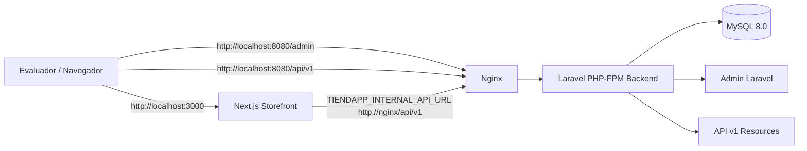
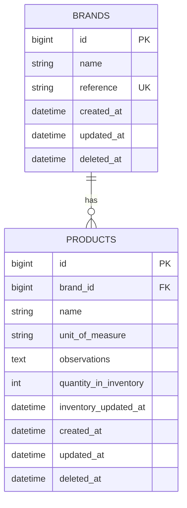

# Tiendapp Catalog

Prueba tecnica Full Stack para Tiendapp S.A.S. con administracion Laravel + MySQL y storefront Next.js conectado a la API del backend.


## Descripcion

Tiendapp Catalog implementa una aplicacion administrativa en Laravel para gestionar marcas y productos, persistida en MySQL, y un ecommerce en Next.js que consume los productos publicados desde la API del backend.

La solucion cubre CRUD de marcas, CRUD de productos, relacion producto-marca, filtros de catalogo, metricas administrativas, seeders idempotentes, pruebas automatizadas y ejecucion completa con Docker Compose.

El foco tecnico esta en una base de datos normalizada, reglas de inventario consistentes, endpoints versionados y una experiencia storefront funcional conectada al backend real.

## Tabla de contenido

- [Descripcion](#descripcion)
- [Arquitectura](#arquitectura)
- [Stack tecnico](#stack-tecnico)
- [Estructura del proyecto](#estructura-del-proyecto)
- [Servicios y puertos](#servicios-y-puertos)
- [Ejecucion con Docker](#ejecucion-con-docker)
- [Variables de entorno](#variables-de-entorno)
- [Modelo de datos](#modelo-de-datos)
- [Indices y eficiencia](#indices-y-eficiencia)
- [API REST](#api-rest)
- [Semantica de inventario](#semantica-de-inventario)
- [Pruebas](#pruebas)
- [Decisiones tecnicas](#decisiones-tecnicas)

## Arquitectura




## Stack tecnico

| Capa | Tecnologia | Uso |
|---|---|---|
| Backend | PHP ^8.3 / Docker PHP 8.4 FPM | Runtime de Laravel |
| Backend | Laravel ^13.8 | Admin, API, validaciones, ORM y pruebas |
| Base de datos | MySQL 8.0 | Persistencia relacional del catalogo |
| Web server | Nginx 1.27 Alpine | Entrada HTTP hacia Laravel |
| Frontend | Next.js 16.2.9 | Storefront conectado a la API |
| UI | React 19.2.4 | Componentes del storefront |
| Lenguaje frontend | TypeScript ^5 | Tipado del ecommerce |
| Estilos | Tailwind CSS ^4 | Interfaz admin y storefront |
| Assets backend | Vite ^8 | Build de assets Laravel |
| Testing | PHPUnit ^12.5 | Pruebas automatizadas backend |
| Contenedores | Docker Compose | Entorno local reproducible |

---

## Estructura del proyecto

```text
backend/                 Aplicacion Laravel: admin, API, modelos, migraciones, seeders y tests
storefront/              Ecommerce Next.js conectado a la API del backend
docker/backend/          Dockerfile y entrypoint del contenedor PHP-FPM
docker/nginx/            Configuracion Nginx para servir Laravel y healthcheck
docs/database-notes.md   Notas tecnicas de base de datos, indices, consultas y escalabilidad
docker-compose.yml       Orquestacion local de MySQL, backend, Nginx y storefront
```


---

## Servicios y puertos

| Servicio | Contenedor | Puerto | URL / Uso |
|---|---|---:|---|
| Storefront Next.js | `tiendapp_storefront` | `3000` | http://localhost:3000 |
| Laravel Admin/API | `tiendapp_nginx` | `8080` | http://localhost:8080 |
| Backend PHP-FPM | `tiendapp_backend` | `9000` interno | Servicio interno para Nginx |
| MySQL | `tiendapp_mysql` | `3307 -> 3306` | Conexion local a base de datos |
| Healthcheck Nginx | `tiendapp_nginx` | `8080` | http://localhost:8080/health |

URLs principales:

| Recurso | URL |
|---|---|
| Storefront | http://localhost:3000 |
| Admin Laravel | http://localhost:8080/admin |
| API v1 | http://localhost:8080/api/v1 |
| Healthcheck | http://localhost:8080/health |

---

## Ejecucion con Docker

Levanta la solucion completa con MySQL, backend Laravel, Nginx y storefront Next.js:

```bash
docker compose up -d --build
```

Luego prepara la base de datos con migraciones y datos de prueba:

```bash
docker compose exec backend php artisan migrate:fresh --seed
```

Verifica que los contenedores esten arriba y saludables:

```bash
docker compose ps
```

Ejecuta la suite de pruebas del backend:

```bash
docker compose exec backend php artisan test
```

El contenedor backend usa un entrypoint no destructivo: instala dependencias si faltan, prepara `.env` si no existe, genera `APP_KEY` cuando es necesario y espera a que MySQL este disponible. Las migraciones y seeders se ejecutan manualmente para evitar borrar datos accidentalmente al iniciar los contenedores.


---

## Evaluacion rapida

Checklist recomendada para validar la entrega despues de levantar los contenedores:

```bash
docker compose ps
docker compose exec backend php artisan migrate:fresh --seed
docker compose exec backend php artisan test
```

Validaciones manuales principales:

| Validacion | URL / Comando esperado |
|---|---|
| Storefront responde | http://localhost:3000 |
| Admin Laravel responde | http://localhost:8080/admin |
| API v1 responde | http://localhost:8080/api/v1/products |
| Healthcheck Nginx responde | http://localhost:8080/health |
| Contenedores saludables | `docker compose ps` |
| Tests backend pasan | `docker compose exec backend php artisan test` |


---

## Variables de entorno

La configuracion esta preparada para Docker Compose. El backend usa MySQL dentro de la red interna de Docker y el storefront usa una URL publica para el navegador y una URL interna para comunicarse con Laravel desde el contenedor Next.js.

### Backend Laravel

| Variable | Valor Docker | Uso |
|---|---|---|
| `APP_NAME` | `Tiendapp Catalog` | Nombre de la aplicacion |
| `APP_ENV` | `local` | Entorno de ejecucion |
| `APP_URL` | `http://localhost:8080` | URL publica del backend Laravel |
| `DB_CONNECTION` | `mysql` | Driver de base de datos |
| `DB_HOST` | `mysql` | Host interno del servicio MySQL |
| `DB_PORT` | `3306` | Puerto interno de MySQL dentro de Docker |
| `DB_DATABASE` | `tiendapp_catalog` | Base de datos principal |
| `DB_USERNAME` | `tiendapp` | Usuario de base de datos |
| `DB_PASSWORD` | `tiendapp` | Password de base de datos |

### Storefront Next.js

| Variable | Valor Docker | Uso |
|---|---|---|
| `NEXT_PUBLIC_API_BASE_URL` | `http://localhost:8080/api/v1` | API publica usada desde el navegador |
| `TIENDAPP_INTERNAL_API_URL` | `http://nginx/api/v1` | API interna usada por Next.js dentro de Docker |
| `NEXT_PUBLIC_ADMIN_URL` | `http://localhost:8080/admin` | Enlace publico hacia el admin Laravel |

---

## Funcionalidades principales

Admin Laravel:
- Crear, editar, listar y eliminar marcas.
- Crear, editar, listar y eliminar productos.
- Relacionar productos con marcas.
- Gestionar unidades de medida.
- Gestionar cantidades de inventario.
- Usar soft deletes.
- Visualizar metricas reales.
- Filtrar y ordenar productos.
- Revisar alertas operativas de inventario.

Storefront Next.js:
- Home conectada a la API Laravel.
- Hero comercial con metricas reales.
- Seccion de productos destacados.
- Carril de marcas.
- Filtros por busqueda, marca, unidad, disponibilidad y orden.
- Paginacion visible.
- Conservacion de filtros en querystring.
- Estados de carga y error.
- Cards de producto con estado visual de inventario.
- Imagenes locales por slug.

API REST:
- API versionada bajo /api/v1.
- Respuestas paginadas.
- Validacion formal de filtros.
- Respuestas 422 ante parametros invalidos.

---

## Modelo de datos

La base de datos esta normalizada alrededor de dos entidades principales: `brands` y `products`.

`products.brand_id` referencia `brands.id`. La disponibilidad del producto no se almacena como una columna duplicada; se deriva desde `quantity_in_inventory`, evitando inconsistencias entre inventario real y estado comercial.



Para mas detalle sobre diseno relacional, indices, patrones de consulta y escalabilidad, ver `docs/database-notes.md`.

## Indices y eficiencia

La estructura de base de datos usa indices simples para integridad referencial e indices compuestos para los patrones reales del catalogo activo: filtros, ordenamientos, SoftDeletes y consultas de inventario.

| Indice | Tabla | Columnas | Justificacion |
|---|---|---|---|
| `idx_brands_reference` | `brands` | `reference` | Identificador unico de marca y busqueda por referencia |
| `idx_brands_active` | `brands` | `deleted_at`, `name` | Listados de marcas activas ordenadas por nombre |
| `idx_products_brand` | `products` | `brand_id` | Soporte de foreign key y lookup directo por marca |
| `idx_products_catalog` | `products` | `deleted_at`, `brand_id`, `unit_of_measure`, `name` | Filtros combinados del catalogo activo y ordenamiento por nombre |
| `idx_products_available` | `products` | `deleted_at`, `quantity_in_inventory`, `brand_id` | Consultas de disponibilidad, rangos de stock y metricas de inventario |
| `idx_products_active_inv_updated` | `products` | `deleted_at`, `inventory_updated_at` | Catalogo activo ordenado por actualizacion de inventario |
| `idx_products_active_brand_inv_updated` | `products` | `deleted_at`, `brand_id`, `inventory_updated_at` | Filtro por marca con ordenamiento por actualizacion de inventario |
| `idx_products_active_unit_inv_updated` | `products` | `deleted_at`, `unit_of_measure`, `inventory_updated_at` | Filtro por unidad de medida con ordenamiento por actualizacion de inventario |
| `idx_products_active_brand_unit_inv_updated` | `products` | `deleted_at`, `brand_id`, `unit_of_measure`, `inventory_updated_at` | Filtro combinado por marca y unidad con ordenamiento por actualizacion de inventario |

Los indices finales fueron validados contra MySQL real con `SHOW INDEX` y `EXPLAIN`. Los indices redundantes `idx_brands_name`, `idx_products_stock`, `idx_products_inv_updated` e `idx_products_unit` fueron eliminados mediante una migracion reversible.

Las busquedas textuales con `LIKE "%texto%"` se mantienen como una decision consciente para soportar busqueda libre por producto, referencia u observaciones. En un catalogo de mayor volumen, la mejora natural seria evaluar `FULLTEXT` o un motor de busqueda dedicado.

Para mas detalle sobre decisiones de indices, consultas, limitaciones aceptadas y validacion con `EXPLAIN`, ver `docs/database-performance.md`.

## API REST

La API publica esta versionada bajo `/api/v1` y expone recursos para marcas, productos y metricas del catalogo. Los listados usan paginacion y validacion de parametros mediante Form Requests.

| Metodo | Endpoint | Uso |
|---|---|---|
| `GET` | `/api/v1/metrics` | Metricas generales del catalogo |
| `GET` | `/api/v1/products` | Listado paginado de productos |
| `GET` | `/api/v1/products/{product}` | Detalle de producto |
| `GET` | `/api/v1/brands` | Listado paginado de marcas |
| `GET` | `/api/v1/brands/{brand}` | Detalle de marca |
| `GET` | `/api/v1/brands/select` | Opciones ligeras de marcas para filtros |

Parametros principales de `GET /api/v1/products`:

| Parametro | Valores soportados | Uso |
|---|---|---|
| `search` | Texto libre | Busca por nombre u observaciones |
| `brand_id` | ID de marca activa | Filtra productos por marca |
| `unit_of_measure` | `Unidad`, `Display`, `Caja` | Filtra por unidad de medida |
| `availability` | `available`, `in_stock`, `healthy_stock`, `low_stock`, `out_of_stock` | Filtra por estado de inventario |
| `sort` | `name`, `stock_asc`, `stock_desc`, `updated_asc` | Ordena el listado |
| `page` | Numero entero mayor o igual a 1 | Pagina actual |
| `per_page` | 1 a 50 | Tamano de pagina |

---

## Filtros de productos

El listado de productos soporta filtros combinables desde el admin, la API y el storefront.

Ejemplos:

```bash
GET /api/v1/products?search=arroz
GET /api/v1/products?brand_id=1
GET /api/v1/products?unit_of_measure=Unidad
GET /api/v1/products?availability=in_stock
GET /api/v1/products?availability=healthy_stock
GET /api/v1/products?availability=low_stock
GET /api/v1/products?availability=out_of_stock
GET /api/v1/products?sort=stock_desc
GET /api/v1/products?brand_id=1&availability=in_stock&sort=name
```

La busqueda textual usa `LIKE "%texto%"`, suficiente para el alcance de la prueba tecnica. Para un catalogo de mayor volumen, la evolucion natural seria evaluar indices `FULLTEXT` o un motor de busqueda dedicado.


---

## Validacion de API

Los parametros de consulta de la API se validan con Form Requests antes de construir las consultas Eloquent. Esto evita filtros invalidos, ordenamientos no soportados y referencias a marcas eliminadas.

Validaciones principales:

| Recurso | Validacion |
|---|---|
| Productos | `search` como texto limitado |
| Productos | `brand_id` debe existir en `brands.id` y no tener `deleted_at` |
| Productos | `unit_of_measure` solo acepta `Unidad`, `Display` o `Caja` |
| Productos | `availability` solo acepta `available`, `in_stock`, `healthy_stock`, `low_stock` u `out_of_stock` |
| Productos | `sort` solo acepta ordenamientos definidos por la aplicacion |
| Productos | `per_page` esta limitado para evitar respuestas excesivas |
| Marcas | `search`, `page` y `per_page` se validan antes de consultar |

Esta validacion mantiene la API predecible para el storefront y reduce riesgo de consultas innecesarias o parametros ambiguos.

---

## Semantica de inventario

La disponibilidad no se almacena como un campo duplicado. Se deriva desde `quantity_in_inventory`, lo que evita inconsistencias entre inventario real, API, dashboard, admin y storefront.

| Estado | Regla | Uso |
|---|---|---|
| `available` / `in_stock` | `quantity_in_inventory > 0` | Producto con inventario disponible |
| `healthy_stock` | `quantity_in_inventory > Product::LOW_STOCK_MAX` | Producto con stock saludable |
| `low_stock` | `quantity_in_inventory BETWEEN 1 AND Product::LOW_STOCK_MAX` | Producto con inventario bajo |
| `out_of_stock` | `quantity_in_inventory <= 0` | Producto sin inventario |

`available` se mantiene como alias de `in_stock` para compatibilidad con clientes existentes de la API. Para metricas de salud de inventario se usa `healthy_stock`, evitando mezclar disponibilidad con stock saludable.

El valor visual de `inventory_status` se presenta como:

| Condicion | Etiqueta |
|---|---|
| `quantity_in_inventory > Product::LOW_STOCK_MAX` | `Stock saludable` |
| `quantity_in_inventory BETWEEN 1 AND Product::LOW_STOCK_MAX` | `Bajo stock` |
| `quantity_in_inventory <= 0` | `Sin stock` |

---

## Datos de prueba

Los seeders cargan datos consistentes para validar el admin, la API y el storefront sin configuracion manual adicional.

Incluyen:

| Dato | Uso |
|---|---|
| Marcas | Permiten validar CRUD, filtros y relacion producto-marca |
| Productos con stock saludable | Validan disponibilidad e indicadores positivos |
| Productos con bajo stock | Validan alertas e inventario critico |
| Productos sin stock | Validan estado `out_of_stock` |
| Unidades de medida | Validan filtros por `Unidad`, `Display` y `Caja` |

Los seeders estan preparados para ser idempotentes, por lo que pueden ejecutarse de forma repetida durante la evaluacion sin duplicar registros esperados.

---

## Comandos utiles

Backend:

```bash
docker compose exec backend php artisan migrate:fresh --seed
docker compose exec backend php artisan test
docker compose exec backend php artisan route:list
```

Storefront:

```bash
cd storefront
npm run lint
npm run build
```

Docker:

```bash
docker compose config --services
docker compose up -d --build
docker compose ps
docker compose logs -f storefront
docker compose down
```

---

## Pruebas

La suite de pruebas del backend valida reglas de negocio, endpoints principales y comportamiento esperado del catalogo.

Ejecutar pruebas:

```bash
docker compose exec backend php artisan test
```

Cobertura principal:

| Area | Validacion |
|---|---|
| Modelo Product | Reglas de inventario y estados derivados |
| API productos | Filtros, busqueda, disponibilidad, ordenamiento y paginacion |
| API marcas | Listados, busqueda y opciones para filtros |
| Metricas | Totales, stock saludable, bajo stock y sin stock |
| SoftDeletes | Validacion de marcas activas y restricciones de eliminacion |
| Seeders | Datos consistentes e idempotentes |
| Smoke tests | Respuesta basica de rutas principales |

La suite actual esta orientada a cubrir el comportamiento critico de la prueba tecnica sin sobredimensionar el proyecto.

---

## Decisiones tecnicas

La solucion prioriza una arquitectura simple, funcional y defendible para una prueba tecnica Full Stack.

| Decision | Justificacion |
|---|---|
| API versionada bajo `/api/v1` | Permite evolucionar endpoints sin romper clientes existentes |
| Modelo relacional normalizado | `products` referencia a `brands` mediante foreign key |
| Disponibilidad derivada | Evita duplicar estado entre inventario y disponibilidad |
| SoftDeletes en marcas y productos | Conserva historial y evita eliminaciones fisicas accidentales |
| Validacion con Form Requests | Centraliza reglas de entrada para admin y API |
| Scopes Eloquent en Product | Reutiliza filtros entre API, admin y storefront |
| Eager loading de marca | Evita consultas N+1 al listar productos |
| Seeders idempotentes | Facilitan evaluacion repetible del proyecto |
| Docker Compose completo | Permite levantar backend, base de datos, Nginx y storefront con un solo flujo |
| Healthchecks en servicios | Mejora confiabilidad del entorno local |
| Storefront conectado a API real | Demuestra integracion Full Stack y no solo vistas estaticas |
| Documentacion de base de datos | Explica indices, consultas y escalabilidad en `docs/database-notes.md` |

---

## Estrategia futura de imagenes

Fase actual:
- storefront/public/catalog/brands
- storefront/public/catalog/products

Fase futura:
- brands.logo_path
- products.image_path
- Laravel Storage
- php artisan storage:link
- API expone logo_url / image_url
- Next.js consume URLs reales de API

Esta decision evita guardar imagenes como BLOB en MySQL y mantiene la base de datos enfocada en informacion relacional.

---

## Estado actual de entrega

La solucion actualmente ofrece:

- Backend Laravel funcional.
- Admin conectado a MySQL.
- API REST versionada.
- Validaciones robustas.
- Storefront Next.js conectado a datos reales.
- Paginacion y filtros.
- Estados visuales modernos.
- Docker Compose con backend, nginx, MySQL y storefront.
- Tests backend.
- Seeders con datos realistas.


---

## Autoria

Prueba tecnica desarrollada para Tiendapp S.A.S. con enfoque en calidad de entrega, experiencia de usuario, mantenibilidad y criterios reales de operacion de catalogo.